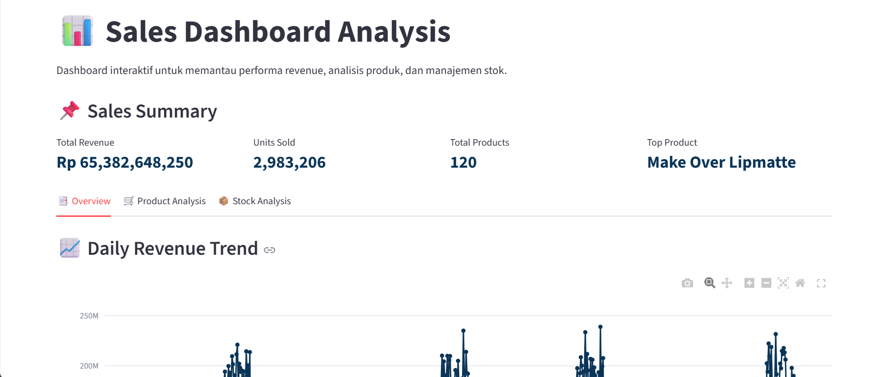
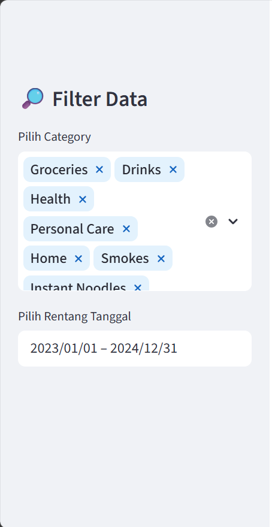
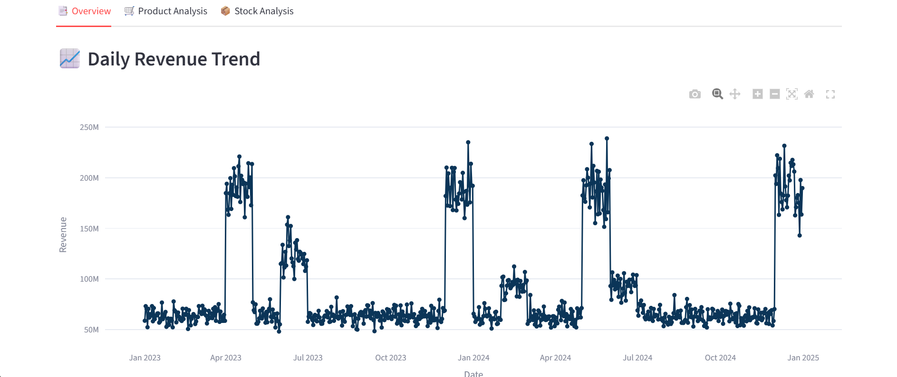
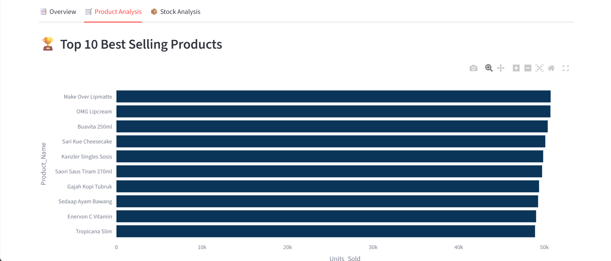
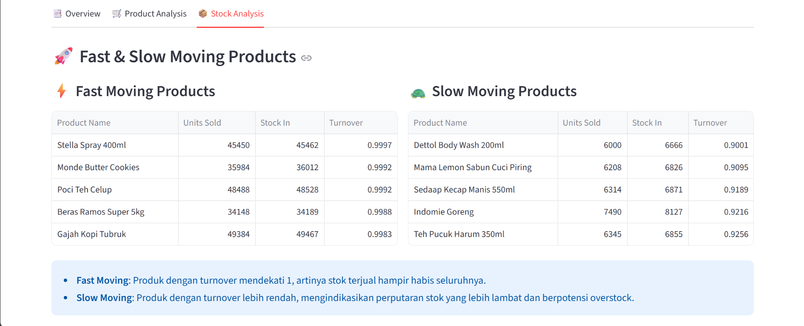
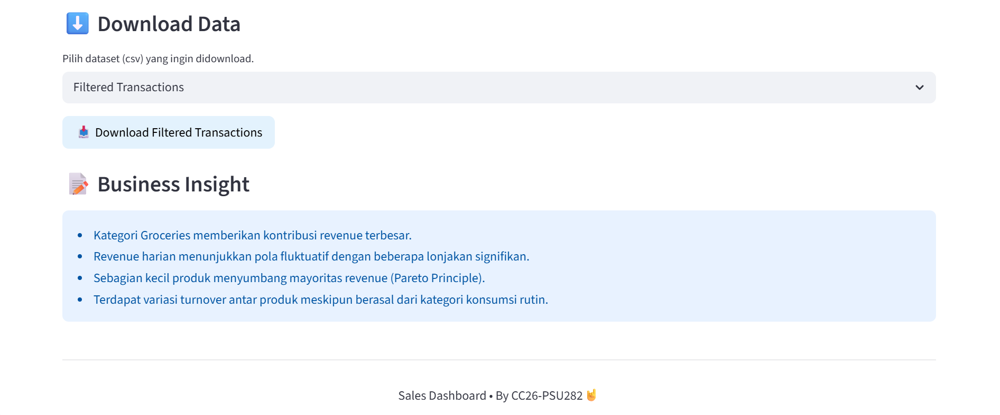

# 📊 Sales Dashboard Analysis — UMKM Transaction Data

Dashboard interaktif untuk menganalisis data transaksi penjualan UMKM, yang meliputi performa revenue, analisis produk terlaris, dan manajemen stok.

---

# 🚀 Project Overview

Project ini dikembangkan untuk membantu proses analisis bisnis retail melalui pendekatan berbasis data. Dataset telah melalui beberapa tahapan preprocessing seperti data cleaning, transformasi data, feature engineering, simulasi inventori, dan data merging sebelum divisualisasikan ke dalam dashboard interaktif.

Dashboard ini menyediakan insight interaktif terkait:
- Performa penjualan dan revenue harian
- Analisis distribusi revenue per kategori
- Identifikasi produk terlaris berdasarkan unit dan revenue
- Analisis Pareto (80/20 rule) pada kontribusi revenue
- Monitoring hubungan antara stok (Stock In & Stock End) dengan penjualan
- Analisis fast-moving vs slow-moving products berdasarkan turnover
- Sistem download dataset hasil filter untuk analisis lanjutan

Selain digunakan untuk visualisasi data, project ini juga dapat dimanfaatkan sebagai media pembelajaran exploratory data analysis (EDA), analisis bisnis retail, serta pengembangan portfolio data science berbasis dashboard interaktif.

---

## 👥 Tim

| Nama | Role |
|------|------|
| Alifah Mu'asyaroh | Data Scientist |
| Alviyatur Rahmaniyah | Data Scientist |

---

## 📁 Struktur Project

```plaintext
dashboard_capstone/
├── assets/                      # Gambar dashboard & asset project
│   ├── sales_summary.png
│   ├── sidebar_filters.png
│   ├── overview.png
│   ├── product_analysis.png
│   ├── stock_analysis.png
│   └── download_and_insights.png
├── data/                      # Dataset
│   ├── transactions_clean.csv       # Dataset utama (sudah dibersihkan)
│   ├── transactions_raw.csv         # Dataset transaksi mentah
│   └── stock_raw.csv                # Dataset stok mentah
├── analysis_transactions.ipynb  # Notebook EDA & analisis
├── dashboard.py                 # Main Streamlit dashboard
├── data_dictionary.md           # Dokumentasi dataset
├── README.md                    # Dokumentasi project
└── requirements.txt             # Daftar library
```

---

## 📌 Pertanyaan Bisnis

1. Produk apa yang paling laku?
2. Produk apa yang memiliki revenue terbesar?
3. Kategori produk apa yang paling dominan?
4. Bagaimana tren revenue harian?
5. Bagaimana hubungan antara stock in dengan penjualan?
6. Bagaimana hubungan antara stock end dengan penjualan?

---

## ⚙️ Data Preprocessing

Beberapa tahapan preprocessing yang dilakukan pada dataset meliputi:
- Data cleaning dan konversi tipe data
- Standarisasi nama produk
- Feature engineering
- Agregasi penjualan harian
- Simulasi inventori
- Data merging

Dokumentasi preprocessing dan penjelasan dataset secara lengkap tersedia pada file:

```plaintext
data_dictionary.md
```

---

## 📊 Fitur Dashboard

### 📌 Sales Summary
Ringkasan metrik utama bisnis yang ditampilkan di bagian atas dashboard:
- Total Revenue
- Total Units Sold
- Total Products
- Top Product

### 🔎 Sidebar Filters
Dashboard menyediakan filter interaktif untuk menyesuaikan analisis data, seperti:
- Rentang tanggal
- Kategori produk

### Analysis Tabs

#### Tab 1 — 📑 Overview
Visualisasi performa bisnis secara umum:
- **Daily Revenue Trend** → Tren pendapatan harian
- **Revenue by Category** → Distribusi revenue per kategori

#### Tab 2 — 🛒 Product Analysis
Analisis performa produk:
- **Top 10 Best Selling Products** → Produk dengan unit penjualan tertinggi
- **Top 10 Revenue Products** → Produk dengan revenue tertinggi
- **Pareto Analysis** → Produk penyumbang mayoritas revenue (80/20 rule)

#### Tab 3 — 📦 Stock Analysis
Analisis kondisi inventori:
- **Stock In vs Units Sold** → Analisis hubungan antara stok masuk dan jumlah penjualan
- **Stock End vs Units Sold** → Analisis hubungan antara sisa stok akhir dan penjualan produk
- **Fast & Slow Moving Products** → Analisis perputaran stok

### ⬇️ Download Data
Dashboard memungkinkan pengguna mengunduh:
- Data hasil filter (Filtered Transactions)
- Dataset transaksi bersih (Transactions Clean)
- Dataset transaksi mentah (Transactions Raw)
- Dataset stok mentah (Stock Raw)

### 📝 Business Insights
Dashboard menyediakan business insights untuk membantu interpretasi visualisasi dan mendukung pengambilan keputusan bisnis berbasis data.

---

## 🖼️ Tampilan Dashboard

### 📌 Sales Summary


### 🔎 Sidebar Filters


### 📑 Overview


### 🛒 Product Analysis Dashboard


### 📦 Stock Analysis Dashboard


### ⬇️ Download and Insights


---

## ⚙️ Cara Menjalankan

### 1. Clone repository project

```bash
git clone https://github.com/alifahmua/sales-dashboard-capstone
```

### 2. Masuk ke folder project

```bash
cd sales-dashboard-capstone
```

### 3. Install dependencies

```bash
pip install -r requirements.txt
```

### 4. Jalankan dashboard

```bash
streamlit run dashboard.py
```

### 5. Buka dashboard di browser

```plaintext
http://localhost:8501
```

---

## 🛠️ Tech Stack

| Library | Kegunaan |
|----------|-----------|
| Streamlit | Framework dashboard interaktif |
| Pandas | Manipulasi dan analisis data |
| Plotly | Visualisasi data interaktif pada dashboard |

---

## 💡 Key Insights

## 💡 Key Insights

- Kategori **Groceries** menjadi kontributor utama terhadap total revenue.
- Revenue harian menunjukkan **pola fluktuatif** dengan beberapa lonjakan yang mengindikasikan kemungkinan pengaruh musiman atau promo.
- Analisis Pareto menunjukkan bahwa sebagian kecil produk menyumbang mayoritas revenue **(80/20 rule)**.
- Terdapat variasi signifikan pada perputaran stok **(turnover)**, yang menunjukkan perbedaan kecepatan penjualan antar produk.
---

## 📄 Informasi Dataset

| Informasi | Nilai |
|---|---|
| Jumlah Baris | 63.161 |
| Jumlah Kolom | 10 |
| Missing Value | Tidak ada |
| Jenis Dataset | Structured Data |
| Domain Dataset | Retail Sales |

---

## 📌 Catatan

- Kolom inventori (`Stock_In`, `Stock_Out`, dan `Stock_End`) merupakan hasil simulasi inventori berdasarkan aktivitas penjualan dan proses restock.
- Dataset telah dibersihkan dan dipersiapkan untuk proses analisis data maupun visualisasi dashboard.
- Project ini dibuat untuk kebutuhan pembelajaran dan pengembangan portfolio data science.

---

> Sales Dashboard • @ CC26-PSU282 🤘